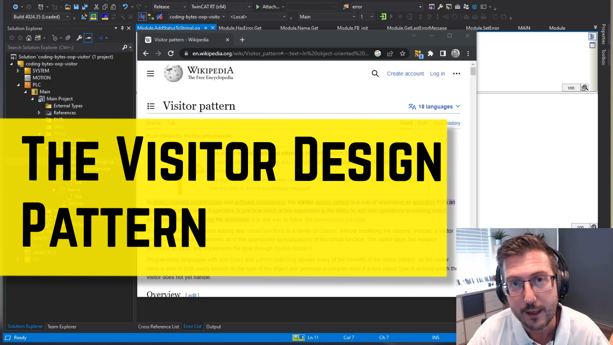

# Coding bytes demo of the Visitor Pattern

## Disclaimer

This is a personal guide not a peer reviewed journal or a sponsored publication. We make
no representations as to accuracy, completeness, correctness, suitability, or validity of any
information and will not be liable for any errors, omissions, or delays in this information or any
losses injuries, or damages arising from its display or use. All information is provided on an as
is basis. It is the reader’s responsibility to verify their own facts.

The views and opinions expressed in this guide are those of the authors and do not
necessarily reflect the official policy or position of any other agency, organization, employer or
company. Assumptions made in the analysis are not reflective of the position of any entity
other than the author(s) and, since we are critically thinking human beings, these views are
always subject to change, revision, and rethinking at any time. Please do not hold us to them
in perpetuity.

## Overview

This is the final code produced during the Coding bytes video "The Visitor Design Pattern". This code is not a final product and should only be consumed as an addition to watching the tutorial.

## Video Tutorial

There is a free coding byte video tutorial on this code which can be found [here](https://beckhoff-au.teachable.com/courses/coding-bytes-twincat-3/lectures/46078048)

## Getting Started

There are a few steps to this project so it would be best to follow along with the video.

## Versions

- TcXaeShell 3.1.4024.35

## Need more help?

Please visit http://beckhoff.com/ for further guides
